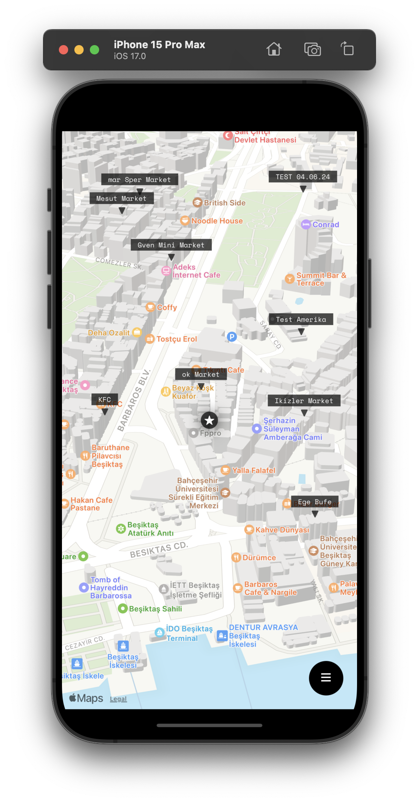
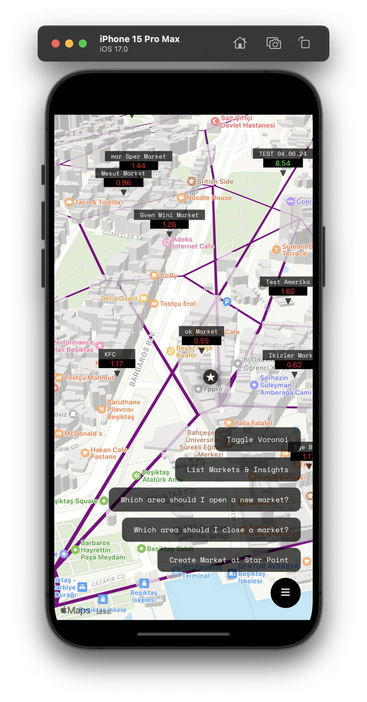
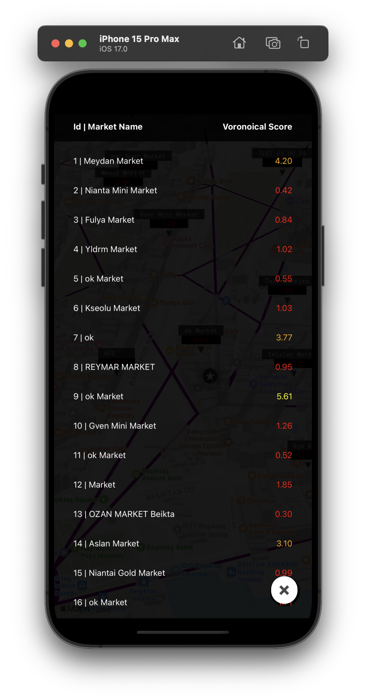
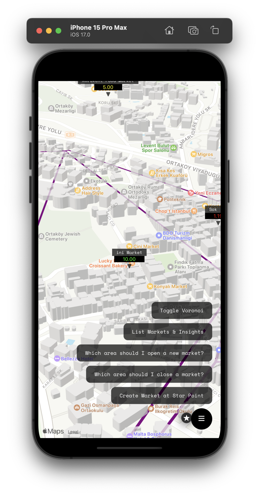
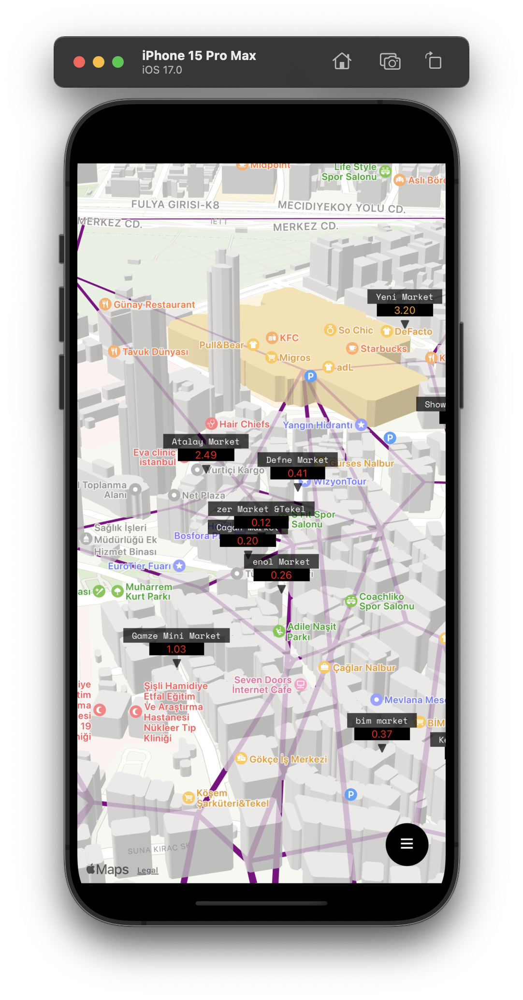
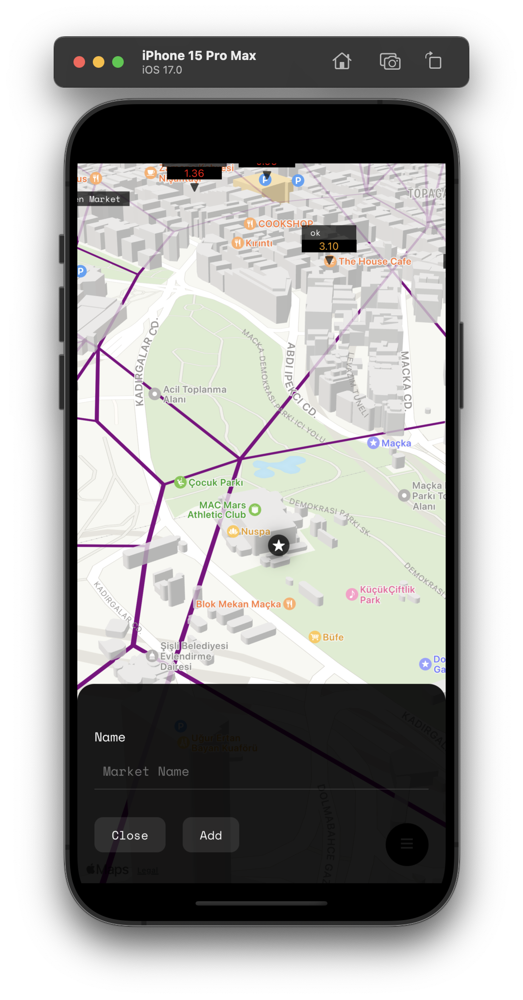
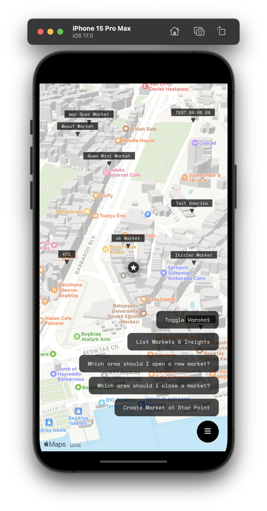
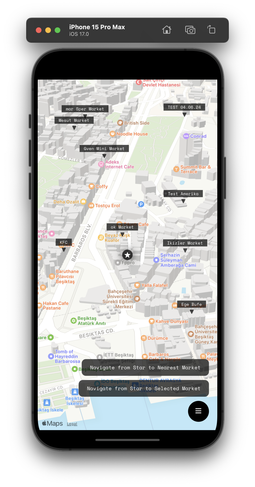
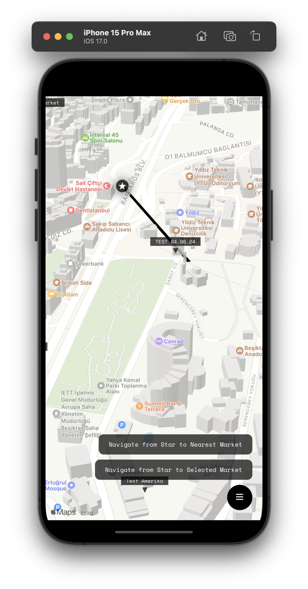

# voronical-gis

This is a repository for the Voronoi-based GIS project. The project has both mobile and backend components. The mobile component is a react-native app that allows users to create and edit Voronoi diagrams. 

## Parts
- Mobile App (React Native)
- Backend (Flask)
- Database (Postgres)
- DB Extensions (postgis, pgRouting)

## Screenshots

    
    
    
    
    
    
    
    
    
    

## System architecture

    

